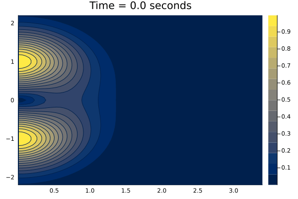
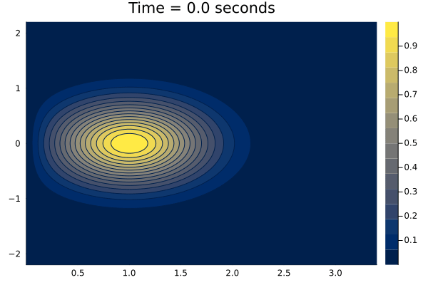
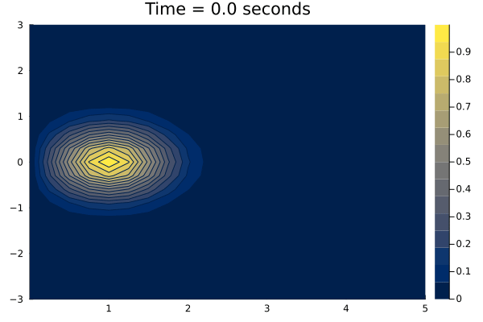

# acousticPropagation

## Abstract

This project is centered on the intricate dynamics of acoustic propagation in fluidic environments. We are reproducing and building on some of the results presented in this [seminal paper](https://www.sciencedirect.com/science/article/pii/S0021999183711423).

## Theory
The evolution of an acoustic pulse with wave speed $c=1$ inside a fluid with linear velocity $M$ on a 2D plane with cylindrical coordinates $(r,\theta)$ is derived from the potential function $\phi(r,\theta,t)$. This is governed by the wave equation:

$$
\frac{\partial^2 \phi}{\partial t^2 }=c^2\cdot \Delta_{r,\theta,M} \phi, \ t>0, \ (r,\theta)\in (0,\infty)\times(0,2\pi)
$$

where $\Delta_{r,\theta}$ is the Laplace operator in cylindrical coordinates in the moving frame of the fluid. The initial conditions at $t=0$, for a circular pulse, are assumed to be radially symmetric, i.e., independent of $\theta$:

$$
\phi(r,0)=0, \ \frac{\partial \phi}{\partial t}(r,0)=\phi'_0(r)
$$

The pressure distribution $p(r,\theta,t)$ can then be deduced as the time derivative of the potential function, i.e., $p=\phi'$. The relation between cylindrical coordinates $(r,\theta)$ and Cartesian ones $(x,y)$ is:

$$
x=r\cos \theta, \ y=r\sin\theta
$$

Using the cylindrical Hankel transform (akin to the 2D Fourier transform) of the initial distribution $\phi'_0$, the equation can be solved. The pressure solution at any time $t>0$ for spatial coordinates $(r,\theta)$ is:

$$
p(r,\theta,t) =  \int_{0}^{\infty} \mathcal{H}\{\phi'_0\}(\omega) \cdot J_0\left( \omega \sqrt{r^2+(M\cdot t)^2-2r\cdot (M\cdot t) \cdot \cos(\theta)}\right)\cdot \omega \cos(\omega t) \  d\omega
$$

The function is given by:

$$
\mathcal{H}\{\phi\prime_{0}\}(\omega)=\int_{0}^{\infty} r'J_0(\omega r')\phi\prime_{0}(r')\  dr'
$$

This is the zero-order Hankel transform of the initial pulse $\phi'_0$.

## Sample Results

Below are some sample animations showcasing the results:

